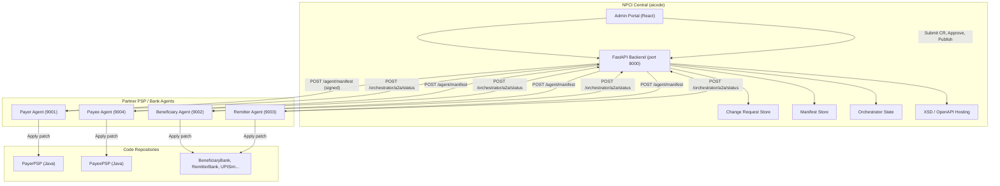
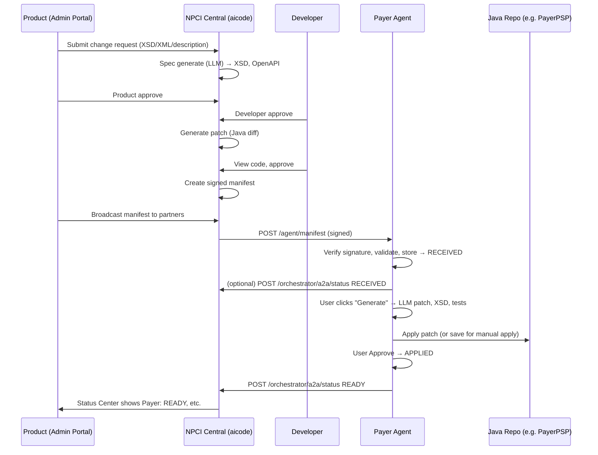

# UPI AI Hackathon – Project Architecture

This document describes the **whole project setup** and high-level architecture for the UPI AI Hackathon demo.

---

## High-Level Architecture Diagram

---

## Component Overview

| Component | Location | Port | Role |
|-----------|----------|------|------|
| **NPCI AI Agent (Central)** | `aicode/` | **8000** | Change lifecycle, spec generation, XSD/OpenAPI, signed manifest creation, broadcast to partners, orchestrator. |
| **Admin Portal** | `aicode/frontend/` | Served by 8000 | Product/Developer UI: change requests, approve, view patch, publish manifest, status center. |
| **Payer Agent** | `Payer-agent/` | **9001** | Receives manifest, LLM-generated code patch, XSD update, tests; reports status to orchestrator. |
| **Beneficiary Agent** | `Beneficiary-agent/` | **9002** | Same flow as Payer (manifest → generate → approve → READY). |
| **Remitter Agent** | `Remitter-agent/` | **9003** | Same flow. |
| **Payee Agent** | `Payee-agent/` | **9004** | Same flow. |
| **Java codebases** | `javacoderepo/` or `UPIVerse/` | — | PayerPSP, PayeePSP, BeneficiaryBank, RemitterBank, UPISim; agents apply patches here. |

---

## Data Flow (Simplified)

---

## Key Endpoints

### NPCI Central (aicode – port 8000)

| Endpoint | Purpose |
|----------|---------|
| `GET /` | Admin Portal (SPA) |
| `POST /npciswitch/spec/generate` | Generate spec from change request |
| `POST /npciswitch/spec/approve/{changeId}` | Product approve |
| `PATCH /npciswitch/change-requests/{changeId}` | Developer approve (creates manifest when Approved) |
| `GET /npciswitch/dev/patch/{changeId}` | Get generated Java patch |
| `POST /npciswitch/manifest/broadcast/{changeId}` | Send manifest to all partners |
| `POST /npciswitch/manifest/send/{changeId}/{partnerId}` | Send manifest to one partner |
| `GET /orchestrator/status` | Full status (per change, per agent) |
| `POST /orchestrator/a2a/status` | Partners report status (RECEIVED, APPLIED, TESTED, READY) |
| `GET /npciswitch/xsd/{changeId}/{file}` | Serve XSD |
| `GET /npciswitch/openapi/{changeId}/{file}` | Serve OpenAPI spec |

### Partner agents (e.g. Payer – port 9001)

| Endpoint | Purpose |
|----------|---------|
| `GET /` | Agent UI |
| `GET /health` | Health + OpenAI configured |
| `POST /agent/manifest` | Receive signed manifest (RECEIVED) |
| `GET /agent/status` | List all changes and states |
| `GET /agent/status/{change_id}` | Get one change (state, artifacts) |
| `POST /agent/status/{change_id}/generate` | Run LLM: patch + XSD + tests |
| `POST /agent/status/{change_id}/approve` | Mark APPLIED, notify orchestrator READY |
| `POST /agent/status/{change_id}/generate-tests` | Generate unit tests, set TESTS_READY |
| `POST /agent/status/{change_id}/run-tests` | Mark TESTED, notify orchestrator |

---

## Partner Registry

Partners and endpoints are defined in **`aicode/partners.json`**:

- `PAYER_AGENT` → `http://localhost:9001/agent/manifest`
- `BENEFICIARY_AGENT` → `http://localhost:9002/agent/manifest`
- `REMITTER_AGENT` → `http://localhost:9003/agent/manifest`
- `PAYEE_AGENT` → `http://localhost:9004/agent/manifest`

Orchestrator URL for agents is set via **`ORCHESTRATOR_URL`** (default `http://localhost:8000`).

---

## Environment / Run Requirements

- **Python 3.x** (aicode + all agents); **Node.js** for frontends.
- **aicode**: `pip install -r requirements.txt`, set `OPENAI_API_KEY` in `aicode/.env`, run `uvicorn` (e.g. port 8000).
- **Each agent**: `pip install -r requirements.txt`, `OPENAI_API_KEY` and optionally `ORCHESTRATOR_URL`, `PAYER_PSP_REPO` (or equivalent) in `.env`; run on 9001, 9002, 9003, 9004.
- **Optional**: Build React frontends (`npm run build`) so backends serve `frontend/dist`.

This architecture supports the end-to-end demo: **change request at NPCI → spec & patch → signed manifest → broadcast to Payer/Payee/Remitter/Beneficiary → each agent generates and applies changes → status back to orchestrator**.
